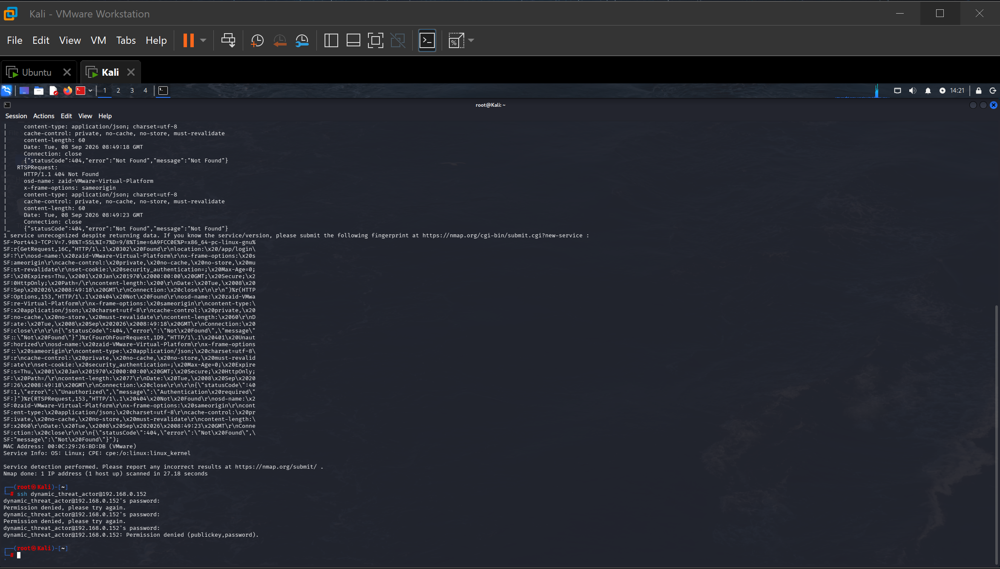
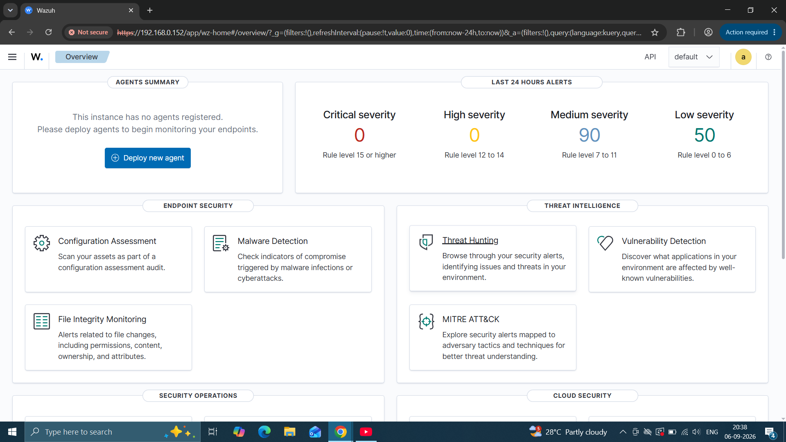
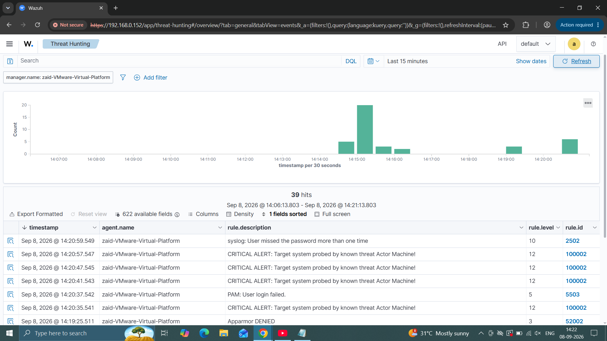
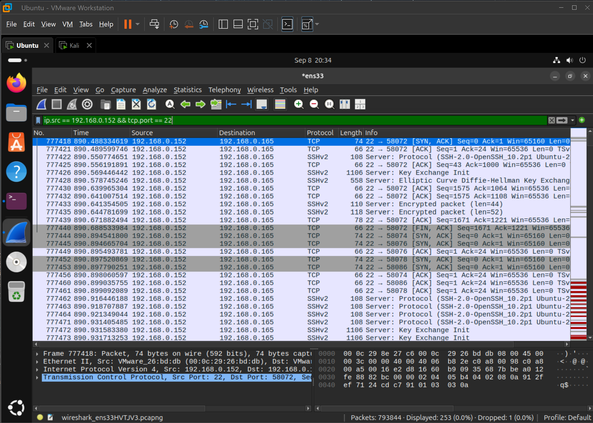
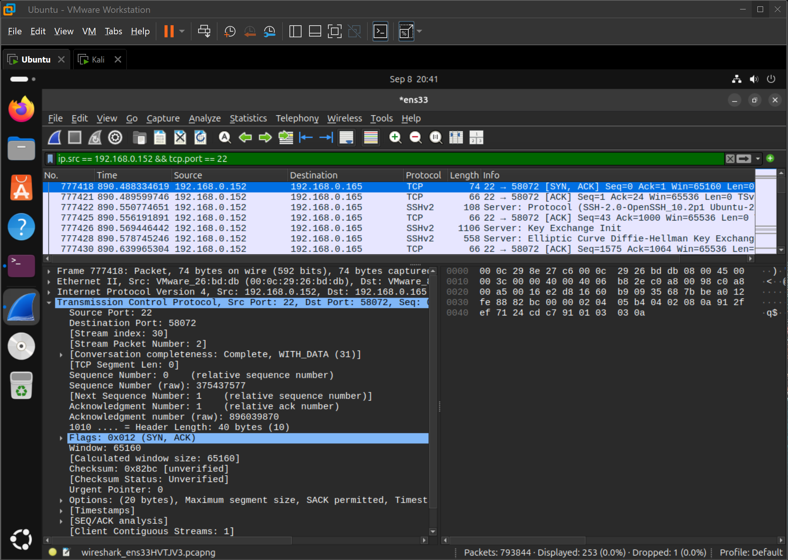

# Multi-Device Purple Team Lab: Threat Detection & Engineering Environment

## Project Overview
Designed and engineered a robust, multi-system Security Operations Center (SOC) laboratory environment to
simulate real-world cyber threat tactics, capture raw network forensics, and author custom telemetry parsing
rules within the **Wazuh SIEM/XDR platform**.
The architecture splits host-based offensive actions from defensive analytics by deploying a dual-laptop
topology utilizing bridged virtual adapters over a local network.

## Logical Network Topology Diagram

+-----------------------------+ +-----------------------------+
| PRIMARY HOST LAPTOP | | SECOND MONITOR LAPTOP |
| (Hypervisor Core Engine) | | (Security Operations Center)|
+--------------+--------------+ +--------------+--------------+
| |
[Bridged Adapter] [Local Wi-Fi]
| |
+------+------+ |
| | v
v v +---------------+
+-----------+ +-----------+ | Windows Host |
| Kali Linux| | Ubuntu | | Web Interface |
| (VM) | |Server (VM)| | Dashboard UI |
| Attacker | | Victim & | |(192.168.0.152)|
| Platform | | SIEM Mgr | +-------+-------+
+-----+-----+ +-----+-----+ ^
| ^ |
| | |
+--[Attacks]--+-----------[Telemetry Stream]--------

## Infrastructure Component Layout

* **Victim Server & SIEM Engine:** Ubuntu Server VM hosting the centralized Wazuh indexing backend, log
processing managers, and validation layers.
*  **Offensive Assessment Node:** Kali Linux VM executing structured reconnaissance scripts and remote
network layer exploits.
* **Defensive Console:** Physical Windows Laptop functioning as a dedicated security monitoring terminal
loading the live graphical dashboard stream via a secure local web portal.

## Threat Scenarios & Detection Engineering Logs

### 1. Host-Based Remote Authentication Cracking (MITRE ATT&CK; T1110)
* **Offensive Profile:** Executed multi-threaded SSH credential verification scans and remote password
exhaustion bursts from the Kali Linux node.

* **Telemetry Analysis:** The Wazuh logging framework securely hooked internal authentication modules
(/var/log/auth.log), auto-aggregating login anomalies to trigger an out-of-the-box Level 10 Critical Brute
Force Signature (Rule ID 5712).
* **Detection Tuning:** Engineered a customized validation rule module (Rule ID 100002) mapping specific
attacker IP markers directly to high-severity warnings, escalating event triggers to Level 12 Actionable Alerts
immediately.

 

 

### 2. Network-Layer Packet Analysis & Triage (Wireshark Forensics)
* **Forensic Methodology:** Captured raw network interface traffic using Wireshark during the active
authentication burst to isolate network-layer Indicators of Compromise (IoCs).
* **Traffic Isolation:** Applied display filters (ip.src == [YOUR_KALI_IP] && tcp.port == 22) to eliminate
background broadcast noise.
* **Deep-Dive Packet Inspection:** Analyzed individual TCP layer structures, validating consistent SYN flags,
repetitive SSH protocol version exchanges, and immediate connection resets.

 

## Core Security Competencies Evidenced
* **SIEM Operations & Rule Engineering:** Developed parsing logic filters linked to industry threat
taxonomies.
* **Network Forensics & Packet Analysis:** Isolated raw packet structures, analyzed TCP handshakes, and
displayed key telemetry markers.
* **Log Aggregation & Normalization:**  Configured host telemetry systems to securely parse and transmit
logs.
* **Infrastructure Engineering:**  Built bridged virtual networks across multiple distinct physical laptop
platforms over routing boundaries

